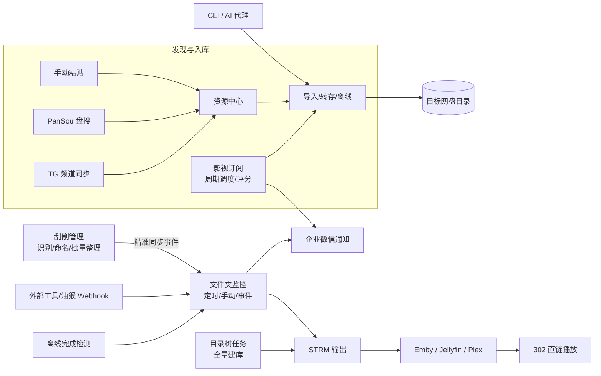
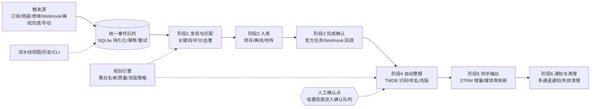

# 使用流程总结、同类项目对比与自动化改造方向（2026-08-18）

> 状态：知识梳理与结论记录，**不是实施计划**。本文回答“我们现在的使用流程是什么、同类项目怎么做、为什么现阶段不适合追求高精度全自动、如果要改造该怎么设计”。后续若决定实施流水线改造，再另行输出 spec / plan。

## 一、结论先行：为什么现阶段不适合做高精度全自动

当前项目的自动化适合覆盖**确定性环节**（触发、转存、同步、通知），不适合直接把**决策环节**（资源选择、命名、删除、移动）全部交给机器。原因：

1. **资源源质量不稳定**：TG 频道 / PanSou 的资源标题混乱、广告混杂、假资源多，机器匹配的“命中”不等于“正确”。
2. **元数据识别不保证准确**：TMDB 识别依赖文件名与网络服务，无法保证 100% 正确；一旦识别错，自动重命名会把错误扩散到整个媒体库。
3. **破坏性操作代价高**：重命名、移动、删除、覆盖（洗版）一旦自动执行出错，恢复成本远高于“让人点一下确认”。
4. **115 没有可靠实时事件**：官方无 webhook / 实时推送，社区标准做法是低频轮询生活事件，天然有秒级~分钟级延迟与漏检风险（详见 `2026-08-16-115-life-events-knowledge.md`）。
5. **风控约束**：115 对高频 API 访问敏感，全自动高频轮询会放大账号风险。
6. **多网盘能力不一致**：五个网盘的离线、整理、STRM、监控能力各不相同，自动链路必须按 provider 能力降级，复杂度高。

**结论**：现阶段目标是“半自动 + 人机协作”——自动化负责确定性的传输与同步，人在关键决策点把关；用规则引擎逐步提高“可自动执行”的比例，但保留确认与回退入口。

---

## 二、当前使用流程总结

### 2.1 部署与初始化（一次性）

- Docker 起服务（镜像 `xianer235/115-media-hub:latest`，端口 18080，持久化 `strm / config / logs`）。
- 填 115 / 夸克 / 天翼 / 123 / 阿里 Cookie。
- 配 STRM 对外访问地址、115 API 最小间隔、缓存 TTL、扫描后缀名。
- 按需启用 PanSou、TMDB、网络代理、企业微信通知、115 每日签到。
- 设置 `webhook_secret`，修改默认账号密码。

### 2.2 日常四条主流程

1. **建库 + 增量**：目录树任务（官方 `files/export_dir` 生成树文件，sha1 未变化跳过）负责全量建库；文件夹监控任务（定时 / 手动 / Webhook）负责持续补新与过期清理。
2. **转存后自动刷新**：外部工具（油猴脚本、CloudSaver 等）调 `/webhook/{任务名}`，按 `savepath` / `sharetitle` 局部刷新；0.8.1 起磁力 / ED2K 由官方离线任务完成检测驱动刷新。
3. **自动找资源**：资源中心（TG 频道同步 / PanSou / 手动粘贴）→ 影视订阅任务按周期、评分阈值、质量偏好匹配 → 创建导入任务 → 转存 / 离线入库。
4. **批量整理**：刮削管理页 TMDB 识别 → 命名预览 → 批量执行 → 走“精准 STRM 同步”事件；监控任务支持“新增资源自动刮削整理”。

### 2.3 输出侧

- STRM 目录挂载给 Emby / Jellyfin / Plex，播放走 302 直链。
- CLI（`cli.py`）让 AI 代理或脚本通过 HTTP API 完成同一套操作。
- 企业微信通知订阅成功与监控生成成功事件。

### 2.4 当前流程总览

### 2.5 现状评价

- 优势：多网盘统一抽象（provider 能力矩阵）、目录树全量 + 监控增量、离线完成检测、精准 STRM 同步、CLI / API 优先，能力广度接近同赛道第一梯队。
- 差距：链路需手工串联（订阅命中后不会自动进入整理）；规则策略偏薄（无统一洗版 / 黑白名单 / 去重决策层）；缺媒体服务器双向联动（只有单向 STRM 输出，没有入库刷新、删除联动）。

---

## 三、同类项目对比

| 项目 | 核心使用流程 | 自动化程度 | 可借鉴点 |
| --- | --- | --- | --- |
| **TgtoDrive** | 找资源（TG 频道 / 榜单 / 关键词白名单 / PanSou / 影巢）→ 自动转存 → 智能整理（分类 / 重命名 / 洗版）→ STRM 增量 → Emby 302 反代播放 | 全链路闭环，规则细化 | 关键词白名单 / 黑名单、榜单订阅、洗版覆盖策略、整理后只增量同步实际变化目录、失效 STRM 清理 |
| **QMediaSync / qmediasync** | 网盘开放平台同步 STRM、元数据下载上传、直链解析、外网 302 | 高度自动化 | Emby 联动：Emby 删除媒体 → 联动删除网盘源文件；入库 / 删除 / 播放通知；媒体库自动刷新 |
| **cloud-media-sync（CMS）** | 常驻服务 + 115 生活事件接口做增量，生成 Emby STRM | 全自动增量 | 事件增量优先、全量兜底（我们已有对应调研文档） |
| **115_Auto_Symlink / OneStrm** | 依赖 CloudDrive2 / Alist 挂载，实时监控 + 软链 / STRM + 元数据复制 | 分钟级“实时”（依赖 CD2 会员） | 挂载层通知路线；软链方案比 STRM 更利于媒体库刮削 |
| **OpenList** | 网盘网关：WebDAV / API 挂载、分享驱动、秒传、离线，媒体服务器直接扫挂载点 | 无 STRM，直挂播放 | “不生成 STRM、直接挂载”的替代路线；秒传 / 离线能力 |
| **MoviePilot** | 订阅 → 搜索链（多站点 / PT）→ 下载链 → 整理刮削 → 媒体库刷新 → 消息通知；内置规则引擎与智能体 | 全链路自动化 + 规则可配置 | 订阅链 / 搜索链 / 下载链拆成独立 Chain；质量优化（低清自动升级）；Agent 自然语言操作 |
| ***arr 全家桶**（Sonarr/Radarr + Prowlarr + qBittorrent + autoscan + Overseerr） | 请求 → 索引器搜索 → 下载器 → 导入硬链 → 媒体库 autoscan 刷新 → 通知 | 成熟的事件驱动流水线 | 下载完成回调驱动下一步（不靠定时）；Overseerr 的“用户请求”入口；任务状态机与失败重试 |
| **Plex Debrid / Riven / DMM** | 用户点播 → Debrid 云盘即时下载 → rclone / zurg 挂载 → Plex 直接播放 | “按需即时”自动化 | 按需触发而非预存全库；观看即入库，无需维护 STRM 目录 |

### 对比结论

1. 我们与 TgtoDrive / QMediaSync 的功能面最接近，差距主要在**编排闭环、规则策略、媒体服务器联动**，不在基础能力。
2. 所谓“高精度全自动”的同类项目，大多依赖相对稳定的资源源（PT 站点、榜单、Debrid 等）或把决策简化为规则，并非“什么都不用管”；**人工确认点仍然存在**（如 *arr 的导入确认、MoviePilot 的整理确认、TgtoDrive 的规则白名单）。这与“现阶段不适合做高精度全自动”的结论一致。
3. 115 生态项目大多聚焦“同步”单点（STRM / 元数据 / 播放），较少覆盖“找资源 → 入库 → 整理”全链路；我们反而更有条件做完整链路，只是需要控制每个阶段的自动化深度。

---

## 四、主流自动化流程的共性

1. **端到端闭环**：请求 / 订阅 → 自动发现 → 自动下载或转存 → 完成回调 → 自动整理刮削 → 入库 / 同步 → 通知。
2. **事件驱动优先**：靠下载完成回调、Webhook、官方任务状态、事件接口做增量触发；定时全量只做兜底。
3. **规则 / 策略可配置**：关键词黑白名单、评分阈值、质量偏好、洗版策略、去重，作为统一决策层。
4. **持久化任务状态机**：pending / running / failed / retry，幂等去重、退避重试、可恢复，异常保留人工干预入口。
5. **媒体服务器双向联动**：入库自动刷新；Emby / Jellyfin 删除媒体时联动清理网盘源文件。
6. **可观测 + 通知**：链路阶段、历史、失败原因可见；完成 / 失败推送到多通道。
7. **API / Agent 优先**：CLI、MCP / HTTP API、自然语言智能体，让外部脚本和 AI 驱动整条链。
8. **增量优先**：目录树 sha1、生活事件游标、监控 mtime，只处理变化，全量只做首次建库和兜底。

---

## 五、改造方向建议（与“无法高精度全自动”的结论一致）

### 5.1 设计原则：分层自动化 + 人机协作

- **自动化确定性环节**：触发（订阅 / 频道 / Webhook）、转存与离线、完成确认、STRM 同步、通知。
- **人确认决策环节**：资源选择（质量 / 版本）、重命名与移动、删除、洗版覆盖。
- **规则渐进提权**：命中评分高、来源可信、命名规则匹配时才允许自动执行；低置信度一律进入人工确认队列。
- 不推翻现有代码：新增“流水线编排 + 统一事件”抽象，复用 `resource_jobs` 状态机、`monitor_change_events` 事件表、`background_runtime`、provider 能力矩阵。

### 5.2 目标架构

### 5.3 分阶段建议

- **P0（推荐先做）**：把“订阅 → 转存 / 离线 → 完成确认 → 监控刷新 → 通知”串成可选流水线；加“自动整理”开关（默认关闭）；补流水线视图与 CLI `pipeline` 命令。0.8.1 的离线完成检测已提供关键事件，本期只做编排层，不碰网盘行为。
- **P1**：规则引擎与洗版策略；Emby / Jellyfin 双向联动；可选启用 115 生活事件增量。
- **P2**：通知多通道化（Bark / Telegram / Server 酱）；Agent 编排接口。

### 5.4 风险与边界

- 全自动意味着系统会“替你执行”错误决策：开关默认关闭、按任务逐步开启，失败保留人工入口。
- 115 有风控：事件源与轮询频率要克制，复用现有 provider 限速锁。
- 所有阶段必须幂等（重复事件不重复执行）。
- 不引入新的消息队列框架，SQLite + 现有后台运行时在个人 NAS 规模足够。

---

## 六、参考资料

- 项目内：[README.md](/Users/xianer/Documents/code/115-media-hub/README.md)、`docs/superpowers/handoff.md`、`docs/superpowers/specs/2026-08-16-115-life-events-knowledge.md`、`docs/superpowers/specs/2026-05-16-multi-provider-design.md`。
- 外部项目：TgtoDrive（github.com/walkingddd/TgtoDrive）、QMediaSync（github.com/qicfan/qmediasync）、cloud-media-sync、115_Auto_Symlink、OpenList（OpenListTeam/OpenList）、MoviePilot（jxxghp/MoviePilot）、*arr 全家桶、Plex Debrid / Riven / DMM。
